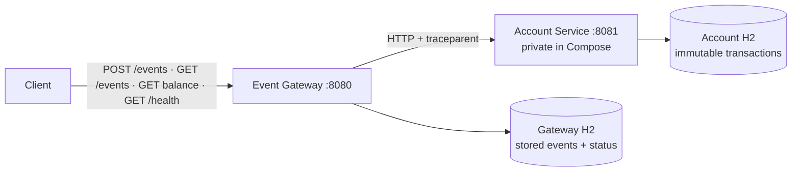
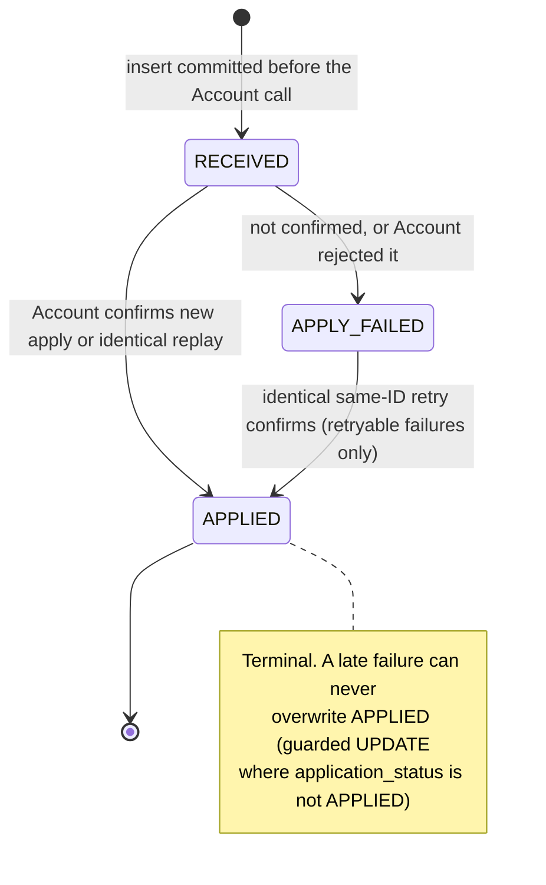

# Event Ledger

[](https://github.com/premkumarkori/event-ledger/actions/workflows/ci.yml)

Event Ledger accepts credit and debit events through an **Event Gateway**,
applies **one financial effect per `eventId`** in an **Account Service**, and
returns an exact derived balance. The design goal is end-to-end idempotency:
network outcomes may stay uncertain, but a same-ID retry can never create a
second financial effect.

Quick facts: Java 17 · Spring Boot 4.1 · Maven multi-module · two H2 databases ·
431 automated tests: 237 Account, 192 Gateway, and 2 real two-service integration tests.

## Architecture



- **Event Gateway** owns intake, validation, event storage, lifecycle status,
  local event queries, and a balance proxy.
- **Account Service** owns the immutable transaction journal, the account
  currency, and derived balances.
- Production communication is **HTTP only**; neither service reads the other's
  tables.
- Each service owns a **separate database**, and both enforce a primary key on
  `event_id` — the database, not a cache, is the final idempotency guard.

Detailed sequence diagrams (happy path, replay, outage) live in
[docs/spec/architecture.md](docs/spec/architecture.md).

## Build and run

Prerequisites: Java 17 (the local Maven JVM may be newer; bytecode target stays
17), Docker with Compose for the demo, `curl` and `jq` for the tour.

```bash
./mvnw test      # 431 tests, includes the real two-service acceptance test
./mvnw verify    # full build with executable JARs
```

### Two terminals, no Docker

```bash
./mvnw -DskipTests package

# Terminal 1
java -jar account-service/target/account-service-0.1.0-SNAPSHOT-exec.jar

# Terminal 2
java -jar event-gateway/target/event-gateway-0.1.0-SNAPSHOT-exec.jar
```

Use the `*-exec.jar` artifacts; the plain JARs are thin module archives.
Default ports: Gateway `8080`, Account `8081`.

### Docker Compose

Images copy the already-built executable JARs, so build first:

```bash
./mvnw verify
docker compose up --build -d
```

Only the Gateway is published to the host (`8080`, override with
`GATEWAY_HOST_PORT`). Account stays private on the Compose network at
`http://account-service:8081`. Named volumes keep the two H2 databases separate.

## Guided tour

The same story `scripts/demo.sh` runs with assertions, as copy-paste commands.
Use a unique Compose project so earlier demo data cannot change the results:

```bash
./mvnw verify
export COMPOSE_PROJECT_NAME="event-ledger-tour-$(date +%s)"
export GATEWAY_HOST_PORT="${GATEWAY_HOST_PORT:-8080}"
export GATEWAY_URL="http://localhost:${GATEWAY_HOST_PORT}"
docker compose build
```

**1. Start the Gateway alone** — it does not need its dependency to boot:

```bash
docker compose up -d event-gateway
curl -sS "$GATEWAY_URL/health" | jq
```

Health reports `"status": "UP"` with `"accountService": "UNKNOWN"` and
`"circuitBreaker": "CLOSED"` — no Account observation exists yet.

**2. Start Account** and wait for the application, not just the container:

```bash
started_at="$(date -u +%Y-%m-%dT%H:%M:%SZ)"
docker compose up -d account-service
until docker compose logs --since "$started_at" --no-color account-service 2>/dev/null \
  | grep -q 'Started AccountServiceApplication'; do sleep 1; done
```

**3. Submit a first event** — expect `201 Created`, a `Location` header, and an
`APPLIED` body:

```bash
cat >/tmp/evt-001.json <<'JSON'
{
  "eventId": "evt-001",
  "accountId": "acct-demo",
  "type": "CREDIT",
  "amount": 150.00,
  "currency": "USD",
  "eventTimestamp": "2026-05-15T14:02:11Z",
  "metadata": {"source": "demo"}
}
JSON

curl -si -H 'Content-Type: application/json' \
  --data-binary @/tmp/evt-001.json "$GATEWAY_URL/events"
```

```json
{
  "eventId": "evt-001",
  "accountId": "acct-demo",
  "type": "CREDIT",
  "amount": 150.00,
  "currency": "USD",
  "eventTimestamp": "2026-05-15T14:02:11Z",
  "metadata": {"source": "demo"},
  "applicationStatus": "APPLIED",
  "receivedAt": "…",
  "appliedAt": "…"
}
```

**4. Submit the identical event again** — expect `200 OK` with
`X-Idempotent-Replay: true` and no second financial effect:

```bash
curl -sS -D /tmp/evt-001-replay.headers -o /tmp/evt-001-replay.json \
  -H 'Content-Type: application/json' \
  --data-binary @/tmp/evt-001.json "$GATEWAY_URL/events"
head -1 /tmp/evt-001-replay.headers
grep -i '^X-Idempotent-Replay:' /tmp/evt-001-replay.headers
jq . /tmp/evt-001-replay.json
```

**5. Check the balance** — expect `150.00 USD`:
`curl -sS "$GATEWAY_URL/accounts/acct-demo/balance" | jq`

**6. Reuse the same `eventId` with a different amount** — expect `409`:

```bash
jq '.amount = 151.00' /tmp/evt-001.json >/tmp/evt-001-conflict.json
curl -sS -D /tmp/evt-001-conflict.headers -o /tmp/evt-001-conflict-response.json \
  -H 'Content-Type: application/json' \
  --data-binary @/tmp/evt-001-conflict.json "$GATEWAY_URL/events"
head -1 /tmp/evt-001-conflict.headers
jq . /tmp/evt-001-conflict-response.json
```

```json
{
  "type": "urn:event-ledger:problem:idempotency-conflict",
  "title": "Event identifier conflict",
  "status": 409,
  "detail": "The eventId already belongs to a different event",
  "instance": "/events"
}
```

**7. Stop Account** to simulate an outage:
`docker compose stop account-service`

**8. Submit a new event during the outage** — expect a bounded `503` with
`Retry-After: 5`. The connect timeout is 300ms and the read timeout 800ms, and
the tests assert the response arrives well inside a generous 3-second bound:

```bash
jq '.eventId = "evt-002" | .amount = 25.00 | .eventTimestamp = "2026-05-14T10:00:00Z"' \
  /tmp/evt-001.json >/tmp/evt-002.json

curl -sS -D /tmp/evt-002-failed.headers -o /tmp/evt-002-failed.json \
  -H 'Content-Type: application/json' \
  --data-binary @/tmp/evt-002.json "$GATEWAY_URL/events"
head -1 /tmp/evt-002-failed.headers
grep -i '^Retry-After:' /tmp/evt-002-failed.headers
jq . /tmp/evt-002-failed.json
```

```json
{
  "type": "urn:event-ledger:problem:account-unavailable",
  "title": "Account Service unavailable",
  "status": 503,
  "detail": "Application of event evt-002 could not be confirmed. Retrying the same eventId is safe.",
  "instance": "/events",
  "eventId": "evt-002",
  "applicationStatus": "APPLY_FAILED"
}
```

The wording is deliberate: a timeout does not prove Account rolled back, so
the Gateway says *could not be confirmed* and keeps the event as retryable.

**9. Local reads keep working; health degrades honestly:**

```bash
curl -sS "$GATEWAY_URL/events/evt-002" | jq .applicationStatus
curl -sS "$GATEWAY_URL/events?account=acct-demo" | jq
curl -sS "$GATEWAY_URL/health" | jq
```

```json
{
  "status": "DEGRADED",
  "service": "event-gateway",
  "checks": {"database": "UP", "accountService": "UNAVAILABLE", "circuitBreaker": "CLOSED"}
}
```

Note the list order: `evt-002` comes first because its `eventTimestamp` is
earlier, even though it arrived later.

**10. Restart Account and retry the identical event** — the safe recovery path.
This tour has only one infrastructure failure, below the circuit's four-call
minimum, so expect `200 OK` with the replay header and `APPLIED`:

```bash
started_at="$(date -u +%Y-%m-%dT%H:%M:%SZ)"
docker compose start account-service
until docker compose logs --since "$started_at" --no-color account-service 2>/dev/null \
  | grep -q 'Started AccountServiceApplication'; do sleep 1; done
curl -sS -D /tmp/evt-002-recovery.headers -o /tmp/evt-002-recovery.json \
  -H 'Content-Type: application/json' \
  --data-binary @/tmp/evt-002.json "$GATEWAY_URL/events"
head -1 /tmp/evt-002-recovery.headers
grep -i '^X-Idempotent-Replay:' /tmp/evt-002-recovery.headers
jq .applicationStatus /tmp/evt-002-recovery.json
```

**11. Balance now includes both events** — `175.00 USD`:
`curl -sS "$GATEWAY_URL/accounts/acct-demo/balance" | jq .balance`

**12. Restart retention** — stop and start Account again on the same named
volume; the balance stays `175.00` and replaying `evt-001` still causes no
second effect.

**13. The fully asserted version** of this tour, including saved
request/response evidence, is `./mvnw verify && bash scripts/demo.sh`.

**14. Cleanup** — removing containers and volumes **deletes that project's
data**. For the manual tour above: `docker compose down -v`. The demo script
uses its own uniquely named project and prints it; clean that one with:

```bash
COMPOSE_PROJECT_NAME=event-ledger-proof-1784139464 docker compose down -v
```

Replace the example project name with the exact name printed by the script.

## Event lifecycle



The stored failure code decides what an identical resubmission does:

| Outcome | Stored state | Client sees | Identical same-ID retry |
|---|---|---|---|
| Confirmed new event | `APPLIED` | `201` + `Location` | `200` + `X-Idempotent-Replay: true`, no Account call |
| Confirmed replay/recovery | `APPLIED` | `200` + `X-Idempotent-Replay: true` | same |
| Timeout, refusal, Account 5xx, open circuit | `APPLY_FAILED` / `RETRYABLE_UNCONFIRMED` | `503` + `Retry-After: 5` | safe — the Gateway calls Account again and reconciles |
| Account idempotency/currency conflict | `APPLY_FAILED` / `TERMINAL_CONFLICT` | `409` | same `409` replayed, **no** new Account call |
| Invalid Account response or internal-contract break | `APPLY_FAILED` / `CONTRACT_ERROR` | `502` | same `502`, no blind Account recall; investigate |

The balance-query `503` deliberately has **no** `Retry-After`: it is an
idempotent read, not a write whose retry needs pacing.

## API at a glance

Event Gateway (public, `:8080`):

| Endpoint | Statuses | Notes |
|---|---|---|
| `POST /events` | `201`, `200`, `400`, `409`, `502`, `503` | see lifecycle table above |
| `GET /events/{eventId}` | `200`, `400`, `404` | served locally; works during an Account outage |
| `GET /events?account={id}` | `200`, `400` | ordered `eventTimestamp ASC, eventId ASC`; empty array for an unknown account |
| `GET /accounts/{id}/balance` | `200`, `400`, `404`, `502`, `503` | pure HTTP proxy; never reads the Gateway database |
| `GET /health` | `200`, `503` | `UP` / `DEGRADED` at 200; `DOWN` at 503 only for its own database |
| `GET /actuator/prometheus` | `200` | `ledger_events_total{outcome=…}` |

Account Service (internal, `:8081`, not published under Compose):

| Endpoint | Statuses | Notes |
|---|---|---|
| `POST /accounts/{id}/transactions` | `201`, `200`, `400`, `409`, `500` | `200` is an identical replay; `500` means bounded collision recovery did not converge and a same-ID retry is safe |
| `GET /accounts/{id}/balance` | `200`, `404` | scalar balance in the established currency |
| `GET /accounts/{id}` | `200`, `404` | balance plus at most 20 newest transactions |
| `GET /health` | `200`, `503` | local database diagnostic |

Errors use RFC 7807 `application/problem+json` with stable
`urn:event-ledger:problem:*` types: `validation`, `not-found`,
`idempotency-conflict`, `currency-conflict`, `downstream-contract`,
`account-unavailable`, `internal`. Machine-readable contracts:
[event-gateway-openapi.yaml](contracts/event-gateway-openapi.yaml) ·
[account-service-openapi.yaml](contracts/account-service-openapi.yaml).

## Resilience and observability

- Finite HTTP timeouts: **300ms connect, 800ms read**; redirects are not followed.
- One named circuit breaker (`accountService`): count-based window of 6, minimum
  4 calls, 50% failure threshold, 5s open state, 2 half-open probe calls.
  Business responses (`404`, `409`, validation `400`) never trip it — only
  infrastructure failures count.
- **No automatic HTTP retry.** The recovery path is an identical same-ID client
  retry, which is safe because both databases enforce the idempotency key.
- W3C `traceparent` is propagated Gateway → Account; a valid incoming trace is
  continued with a new child span.
- Structured ECS JSON logs. Application outcome lines deliberately omit event
  IDs, account IDs, amounts, metadata, and downstream bodies; focused tests
  assert those fields are absent from those application lines.
- Micrometer counter `ledger.events` with exactly four outcomes: `created`,
  `replayed`, `conflict`, `apply_failed`.

## Storage and limitations

- Local and Compose runtime use file-backed H2 under separate paths
  (`./runtime-data/gateway`, `./runtime-data/account`) or separate named
  volumes. Automated tests use isolated in-memory H2.
- Container stop/start with the same named volume retains committed rows. That
  is a scoped claim — not production HA, backup, or disaster recovery.
- Authentication and authorization are outside this project's scope.
- No message broker, distributed transaction, or two-phase commit; not
  double-entry accounting — one immutable journal and a derived balance.
- Negative balances are allowed; one currency per account.
- Deleting Compose volumes deletes that project's data.

Optional features: Prometheus exposition is implemented and Java 17 CI runs on
every push (badge above); both OpenAPI contracts pass a Redocly CLI lint run
locally. Automatic HTTP retry, Jaeger/OTLP collector UI, Pact, rate limiting,
and a reconciliation worker are deferred.

## Going deeper

1. [Design walkthrough — start here](docs/START-HERE.md)
2. [Architecture and sequence diagrams](docs/spec/architecture.md)
3. [Requirements](docs/spec/requirements.md)
4. [API contract](docs/spec/api-contract.md)
5. [Architecture decisions](docs/decisions/README.md)
6. [Demo runbook](docs/validation/demo-runbook.md)
7. [Acceptance test catalog](docs/validation/acceptance-test-catalog.md)

AI tools assisted with bounded implementation and independent review. Public
claims are backed by code, tests, or a repeatable demo—not by unpublished
prompts or private notes.
