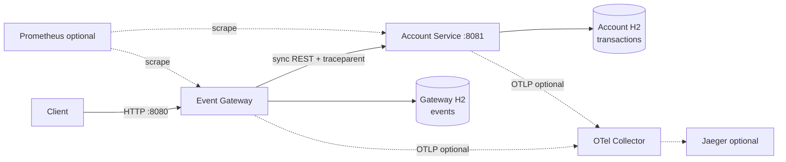
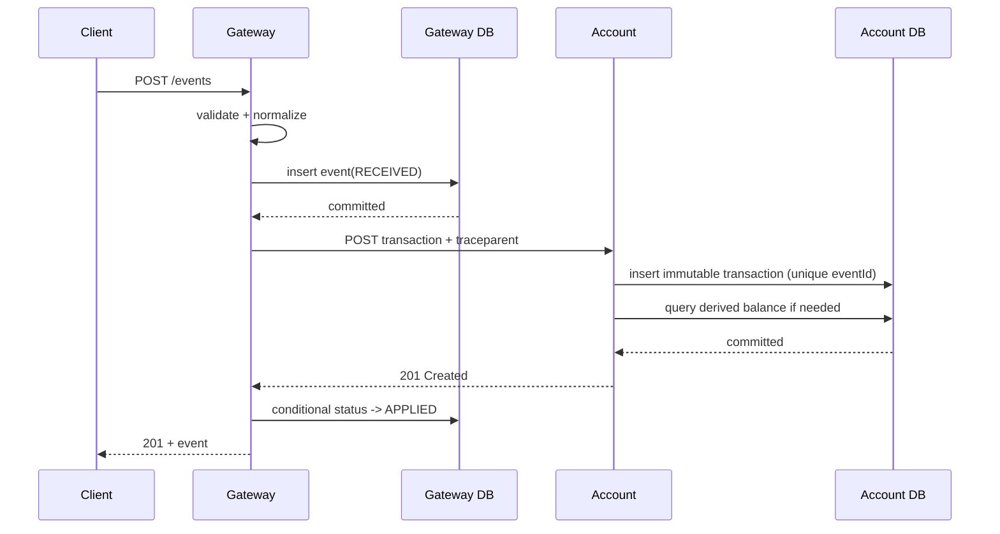
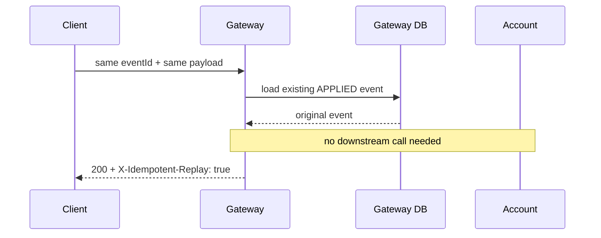
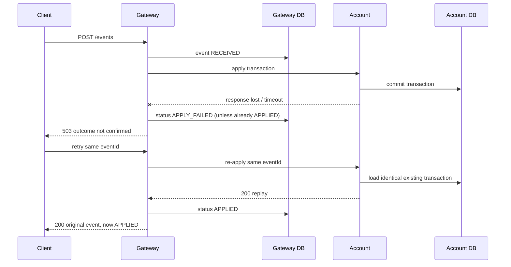

# Architecture

## 1. System view



The two service databases have no link. Default runtime profiles use two different file-backed H2 paths/volumes; tests use isolated in-memory H2. The dotted components are bonus runtime tooling, not required for correctness.

## 2. Responsibilities

### Event Gateway

Owns:

- public request validation;
- the original normalized event record;
- Gateway idempotency and ID-collision detection;
- application lifecycle status;
- local event queries and event-time ordering;
- synchronous Account client;
- timeout/circuit mapping to `503`;
- incoming trace creation/continuation and outgoing propagation;
- Gateway health and event-ingestion metrics.

Does not own:

- financial balance truth;
- applied transaction history;
- Account database access;
- a claim that a timeout means Account rolled back.

### Account Service

Owns:

- the immutable applied transaction journal;
- downstream idempotency and collision detection;
- one-currency-per-account invariant;
- balance query (`SUM credits - SUM debits`);
- account details and recent transaction query;
- local health.

Does not own:

- public client validation policy beyond defensive contract validation;
- Gateway event lifecycle;
- Gateway database access.

## 3. Maven/repository boundary

Planned modules:

```text
event-ledger/
├── pom.xml
├── mvnw
├── mvnw.cmd
├── .mvn/wrapper/
├── event-gateway/
├── account-service/
├── integration-tests/
├── contracts/
├── docs/
├── scripts/
├── docker-compose.yml
└── README.md
```

The root POM aggregates modules and pins Java/platform versions. It does not contain shared business classes.

Why no shared DTO JAR:

- a shared runtime library couples service releases;
- it can hide an accidental distributed monolith;
- the HTTP/OpenAPI contract is the service boundary;
- duplicated small transport records are cheaper than coordinated deployment coupling here.

The `integration-tests` module may depend on both applications for test startup. To make those ordinary Maven dependencies reliable, each service keeps its normal thin JAR as the main artifact and attaches the Spring Boot executable JAR with the `exec` classifier. Docker and `java -jar` commands use `*-exec.jar`; the test module consumes only the thin artifacts. Because both service resources then share one test classpath, each launched context selects a distinct integration-only config location rather than ambiguously loading two `application.yml` files. This test-only dependency does not become a production communication path.

## 4. Successful write flow



The network call happens after the Gateway insert transaction commits. There is no attempt to make a remote call part of a local JPA transaction.

## 5. Replay after success



## 6. Lost Account response / safe recovery



This is why Account idempotency is a requirement, even though Gateway already deduplicates.

## 7. Read behavior during failure

| Operation | Account healthy | Account unavailable |
|---|---|---|
| `POST /events` | apply and respond | bounded `503`, local event retained |
| `GET /events/{id}` | local `200/404` | same local `200/404` |
| `GET /events?account=...` | local ordered list | same local ordered list |
| Required `GET /accounts/{id}/balance` Gateway proxy | proxy `200/404` | clear `503` |
| Selected enhanced Gateway health SHOULD | `UP` | `DEGRADED` or `UP` with dependency unavailable; DB still checked |

## 8. Correctness invariants

1. `eventId` is immutable end-to-end.
2. One Gateway row per event ID.
3. One Account transaction row per event ID.
4. Same ID with different semantic payload is never accepted as replay.
5. `APPLIED` cannot transition backward.
6. Balance is derived only from successfully inserted Account transactions.
7. Event query order uses business time, not processing time.
8. A timeout produces an unknown remote outcome, not proof of rollback.
9. Automatic retry, if selected, is gated and bounded; same-ID client recovery relies on downstream idempotency.
10. Metrics/logs do not use financial identifiers as tags or dump metadata.

## 9. Embedded storage and scaling boundary

Use file-backed H2 for default local/Compose runtime and a separate file/volume per service. That lets the failure demo stop and start a process without erasing already committed rows. Use unique in-memory H2 databases for automated test isolation.

File-backed does **not** make these services horizontally scalable or production durable. A single embedded file is still instance-local. A production evolution would use PostgreSQL or another managed durable store, schema migrations, reconciliation, backups, and likely an outbox/broker flow. Do not claim that switching databases is only a JDBC URL change; SQL, locking, migrations, operations, and concurrency tests must be revisited.
