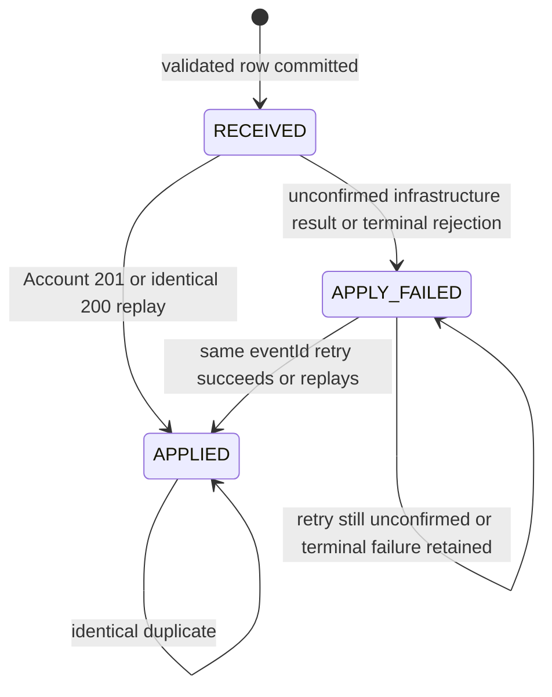

# Data model and state machines

## 1. Gateway event table

Logical schema (DDL lives with each service under `db/*/schema.sql`):

| Column | Type | Rule / purpose |
|---|---|---|
| `event_id` | varchar PK | business idempotency key |
| `account_id` | varchar not null | account identifier |
| `event_type` | varchar not null | `CREDIT` or `DEBIT` |
| `amount` | decimal(38,18) not null | exact positive number |
| `currency` | char(3) not null | normalized uppercase |
| `event_timestamp` | timestamp with time zone | upstream business time |
| `metadata_json` | CLOB not null | normalized JSON object; `{}` means no metadata |
| `application_status` | varchar not null | `RECEIVED`, `APPLIED`, `APPLY_FAILED` |
| `received_at` | timestamp with time zone | Gateway processing time |
| `last_attempt_at` | timestamp with time zone nullable | diagnostics |
| `applied_at` | timestamp with time zone nullable | confirmation time |
| `attempt_count` | integer not null | diagnostics; not a metric tag |
| `last_failure_code` | varchar nullable | bounded machine-readable reason and retry classification |
| `last_failure_message` | varchar nullable | sanitized, length limited |
| `version` | bigint not null | optimistic update/monotonic transition aid |

Index:

```text
(account_id, event_timestamp, event_id)
```

Do not store a raw request string for equality. The entity fields are the
normalized business payload. Missing or `null` metadata becomes `{}`; parse and
store it as a JSON tree and compare it with ordinary `JsonNode.equals`. Jackson
object-node equality ignores member order, while array order and numeric node
representation remain significant. Do not add a recursive numeric canonicalizer
for metadata; top-level financial `amount` still uses `BigDecimal.compareTo`.

## 2. Account transaction table

| Column | Type | Rule / purpose |
|---|---|---|
| `event_id` | varchar PK | downstream idempotency key |
| `account_id` | varchar not null | owner |
| `event_type` | varchar not null | credit/debit |
| `amount` | decimal(38,18) not null | exact amount |
| `currency` | char(3) not null | account currency |
| `event_timestamp` | timestamp with time zone | business time |
| `applied_at` | timestamp with time zone | processing/audit time |

Indexes:

```text
(account_id, event_timestamp, event_id)
(account_id, currency)
```

There is intentionally no mutable balance row in the core implementation.

## 3. Balance query

Conceptual SQL:

```sql
select
  account_id,
  currency,
  coalesce(sum(case
    when event_type = 'CREDIT' then amount
    when event_type = 'DEBIT' then -amount
  end), 0) as balance
from account_transactions
where account_id = :accountId
group by account_id, currency;
```

Benefits:

- duplicate protection is the primary-key constraint;
- two different concurrent inserts cannot lose each other's effect;
- out-of-order arrival is irrelevant to an additive sum;
- no derived balance can drift from the journal.

Trade-off:

- the sum cost grows with history. Production could add a materialized balance/snapshot with locking, reconciliation, and tests while retaining the journal as source of truth.

## 4. One-currency-per-account check

Use a small `accounts(account_id PK, currency)` table as the database-backed guard. Do not rely on “query current currency, then insert” in Java; two first requests can both see no row.

The Account orchestrator is not transactional. Its `applyOnce` collaborator runs one local transaction:

1. load an existing transaction by `eventId`; return replay/conflict if present;
2. load the account row;
3. if the account exists with another currency, throw the semantic `409` error;
4. if absent, insert `accounts(account_id, currency)`;
5. insert the immutable transaction;
6. commit the account row and transaction together.

If a database unique violation occurs, that transaction is discarded. In a **fresh** transaction the orchestrator resolves the collision in this order:

1. if the event now exists, compare and return replay/conflict;
2. otherwise load the account;
3. if its currency differs, return currency conflict;
4. if its currency matches and the event is absent, the collision was likely concurrent account creation for another event; retry `applyOnce` once with a fresh transaction.

This bounded local retry is not the HTTP retry bonus. It resolves a database race. If it still cannot converge, surface an internal failure and keep the original transaction rolled back; do not spin.

Because the account row and financial transaction commit together, a crash cannot leave a newly established empty account from this path. The account currency is immutable after creation.

Account tables therefore become:

```text
accounts(account_id PK, currency, created_at)
account_transactions(event_id PK, account_id FK, ...)
```

## 5. Gateway state machine



Forbidden transitions:

```text
APPLIED -> RECEIVED
APPLIED -> APPLY_FAILED
any state -> different payload
```

Use conditional updates:

```text
markApplied(eventId): set APPLIED, appliedAt, and clear last failure fields
                      where current status is RECEIVED or APPLY_FAILED
markFailed(eventId): set APPLY_FAILED plus bounded failure code/message only
                     where current status <> APPLIED
```

This prevents a late failing concurrent request from overwriting a successful
result and preserves the first stored `appliedAt` when a second successful caller
arrives after the row is already `APPLIED`.

Stored failure classes:

```text
RETRYABLE_UNCONFIRMED: timeout, connect failure, open circuit, selected 5xx
TERMINAL_CONFLICT: Account idempotency or account-currency conflict
CONTRACT_ERROR: defensive Account 400/invalid response; investigate, do not blind-retry
```

All three produce “not confirmed successful,” but only the first is the normal same-ID recovery path. `RECEIVED` is normally short-lived; it can remain durable if Gateway crashes after its insert and before it records any outcome.

## 6. Insert-or-load transaction boundary

Avoid this unsafe pattern:

```text
@Transactional
try insert
catch DataIntegrityViolationException
query existing row in same transaction
```

The failed insert can mark the transaction rollback-only.

Use an outer orchestration service and separate transaction methods/beans. Gateway uses this pattern directly; Account uses the same fresh-transaction rule for event/account unique races described in section 4:

```text
orchestrator (not transactional)
  -> eventWriter.tryInsert(...)        REQUIRES_NEW/local transaction
  -> if unique collision:
       eventReader.load(...)           fresh transaction
  -> remote Account call               no DB transaction held
  -> eventStatusWriter.mark...(...)    fresh transaction
```

Alternative database-native upsert is allowed if its behavior is clear and tested on H2.

## 7. Normalization/equality examples

These are identical:

```json
{"amount": 150.0, "currency": "usd", "metadata": {"b": 2, "a": 1}}
{"amount": 150.00, "currency": "USD", "metadata": {"a": 1, "b": 2}}
```

Assuming the identifiers, type, and instant also match, numeric comparison, currency normalization, and JSON-tree equality treat them as the same event.

Metadata numeric representation is deliberately not canonicalized. For example,
`{"ratio": 1}` and `{"ratio": 1.00}` may conflict under `JsonNode.equals`; that
is an accepted simplification because metadata is descriptive, not the financial
amount.

These conflict:

- changed account;
- changed credit/debit type;
- changed numeric amount;
- changed currency;
- changed event instant;
- changed metadata value or array order.

## 8. Time semantics

| Field | Meaning | Used for ordering? |
|---|---|---|
| `eventTimestamp` | when upstream says the business event happened | Yes |
| `receivedAt` | when Gateway accepted the payload | No, diagnostics only |
| `appliedAt` | when Account commit was confirmed/recorded | No, diagnostics only |

The project does not recalculate a non-commutative historical state. Credit/debit addition is commutative, so arrival order does not change the final sum. If a future overdraft fee or daily limit depends on historical sequence, the model must change.
